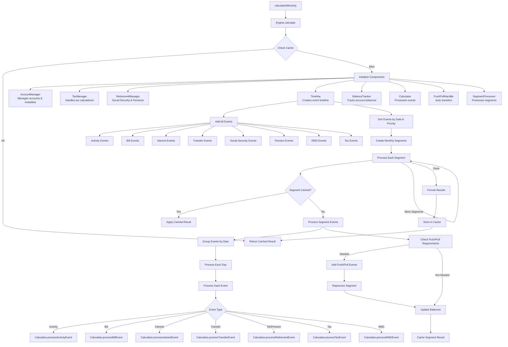

# Calculate V3 Engine Documentation

## Overview

The Calculate V3 engine is an advanced financial calculation system that processes accounts, bills, transfers, interest, retirement payments, taxes, and RMDs (Required Minimum Distributions) over time. It provides optimized performance through caching, segment-based processing, and parallel computation.

## Data Flow

The calculation begins with `calculateAllActivity` in `engine.ts`, which initiates the following flow:



## Component Responsibilities

### Core Components

#### `engine.ts` - Main Orchestrator
- **Purpose**: Entry point and main orchestration layer
- **Key Functions**:
  - `calculateAllActivity()`: Public API entry point for calculations
  - `Engine.calculate()`: Main calculation flow with caching
  - `initializeCalculation()`: Sets up all components
  - `performCalculations()`: Executes segment processing
  - `formatResults()`: Rounds and formats final output

#### `timeline.ts` - Event Management
- **Purpose**: Creates and manages the chronological timeline of all financial events
- **Key Functions**:
  - `fromAccountsAndTransfers()`: Factory method to build timeline
  - `add*Events()`: Methods to add different event types (activities, bills, interest, etc.)
  - `sortEvents()`: Sorts events by date and priority
  - `createSegments()`: Groups events into monthly segments for processing
- **Event Priority**:
  - 0: Interest (applies first)
  - 1: Activities
  - 2: Bills, Retirement payments
  - 3: Taxes, RMDs

#### `segment-processor.ts` - Segment Processing
- **Purpose**: Processes monthly segments of events with caching
- **Key Functions**:
  - `processSegment()`: Main segment processing with cache check
  - `processSegmentEvents()`: Processes all events in a segment
  - `processDayEvents()`: Groups and processes events by day
  - `processEvent()`: Routes events to appropriate calculator methods

#### `calculator.ts` - Financial Calculations
- **Purpose**: Performs actual financial calculations for each event type
- **Key Functions**:
  - `processActivityEvent()`: Handles manual transactions
  - `processBillEvent()`: Processes recurring bills with variables
  - `processInterestEvent()`: Calculates compound interest
  - `processTransferEvent()`: Handles money transfers between accounts
  - `processTaxEvent()`: Calculates and applies taxes
  - `processRMDEvent()`: Handles Required Minimum Distributions
  - `processRetirementEvent()`: Processes Social Security and Pension payments

### Support Components

#### `balance-tracker.ts` - Balance Management
- **Purpose**: Tracks account balances throughout calculation with snapshots
- **Features**:
  - Balance snapshots for performance
  - Activity index tracking
  - Historical balance restoration

#### `account-manager.ts` - Account Registry
- **Purpose**: Manages account lookup and metadata
- **Features**:
  - Account lookup by ID or name
  - Retirement account tracking
  - Interest-bearing account identification

#### `tax-manager.ts` - Tax Calculations
- **Purpose**: Tracks taxable events and calculates tax obligations
- **Features**:
  - Taxable occurrence tracking
  - Annual tax calculation
  - Tax rate management

#### `retirement-manager.ts` - Retirement Income
- **Purpose**: Manages Social Security and Pension calculations
- **Features**:
  - Payment amount calculations
  - Inflation adjustments
  - Annual income tracking

#### `push-pull-handler.ts` - Automatic Transfers
- **Purpose**: Handles automatic balance maintenance transfers
- **Features**:
  - Minimum balance maintenance
  - Automatic push when balance too high
  - Automatic pull when balance too low

#### `cache.ts` - Performance Optimization
- **Purpose**: Caches calculation results for performance
- **Features**:
  - Full calculation result caching
  - Segment-level caching
  - Balance snapshot caching
  - Disk and memory cache options

#### `types.ts` - Type Definitions
- **Purpose**: Central type definitions for the engine
- **Key Types**:
  - Event types (Activity, Bill, Interest, Transfer, etc.)
  - Configuration options
  - Segment and cache structures

## Key Design Features

### 1. **Segment-Based Processing**
- Events are grouped into monthly segments
- Each segment can be cached independently
- Allows for parallel processing potential

### 2. **Multi-Level Caching**
- Full calculation results cached
- Individual segment results cached
- Balance snapshots for quick restoration

### 3. **Event Priority System**
- Events processed in priority order within same date
- Ensures correct calculation order (e.g., interest before bills)

### 4. **Automatic Balance Management**
- Push/Pull system maintains account minimums
- Automatic transfers when thresholds crossed
- Segment reprocessing when transfers added

### 5. **Variable Support**
- Special variables like {HALF}, {FULL} for dynamic amounts
- Variables resolved during calculation
- Support for simulation-specific values

### 6. **Historical Accuracy**
- Always processes from earliest data
- Filters results to requested date range
- Maintains balance continuity

## Performance Optimizations

1. **Parallel Event Loading**: All event types loaded concurrently in Timeline
2. **Sorted Event Processing**: Events pre-sorted to avoid repeated sorting
3. **Segment Caching**: Monthly segments cached to avoid recalculation
4. **Balance Snapshots**: Periodic snapshots avoid recalculating from start
5. **Lazy Evaluation**: Only processes segments within requested date range
6. **Efficient Lookups**: Hash maps for O(1) account and event lookups

## Usage Example

```typescript
const result = await calculateAllActivity(
  accountsAndTransfers,  // Input data
  startDate,              // Start date for results
  endDate,                // End date for results
  'Default',              // Simulation name
  false,                  // Monte Carlo flag
  1,                      // Simulation number
  1,                      // Total simulations
  false,                  // Force recalculation
  true,                   // Enable logging
  {                       // Configuration
    snapshotInterval: 'monthly',
    useDiskCache: true,
    diskCacheDir: './cache'
  }
);
```

## Data Flow Summary

1. **Input**: AccountsAndTransfers object with accounts, bills, transfers
2. **Timeline Creation**: All events generated and sorted chronologically
3. **Segmentation**: Events grouped into monthly segments
4. **Processing**: Each segment processed with caching
5. **Balance Updates**: Account balances updated after each event
6. **Push/Pull**: Automatic transfers added if needed
7. **Output**: Updated AccountsAndTransfers with consolidatedActivity

The engine ensures accurate financial projections by processing events in the correct order, maintaining balance continuity, and applying all financial rules (taxes, RMDs, interest, etc.) appropriately.